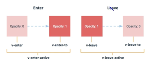

# cli-vue2

## Project setup
```
npm install
```

### Compiles and hot-reloads for development
```
npm run serve
```

### Compiles and minifies for production
```
npm run build
```

### Lints and fixes files
```
npm run lint
```

### Customize configuration
See [Configuration Reference](https://cli.vuejs.org/config/).


- babel.config.js babel 控制文件
- package.json 包依赖
- package-lock.json 包锁定


2. Vue脚手架隐藏了所有webpack相关配置，若想查看具体的webpack配置，请执行
``` bash
vue inspect > output.js
```

/**
关于不同版本的Vue
    1. vue.js 与 vue.runtime.xxx.js的区别
        （1）. vue.js是完整的Vue 包含： 核心功能+模版解析器
        （2）. vue.runtime.xxx.js是运行版的Vue，只包含：核心功能；没有模版解析器
    2. 因为vue.runtime.xxx.js没有模版解析器，所以不能使用template配置项，需要使用
        render函数接收到的createElement函数去指定具体内容

*/

See https://cli.vuejs.org/zh/config/#pages

vue.config.js
``` js
pages: {
    index: {
      // page 的入口
      entry: 'src/index/main.js',
      // 模板来源
      template: 'public/index.html',
      // 在 dist/index.html 的输出
      filename: 'index.html',
      // 当使用 title 选项时，
      // template 中的 title 标签需要是 <title><%= htmlWebpackPlugin.options.title %></title>
      title: 'Index Page',
      // 在这个页面中包含的块，默认情况下会包含
      // 提取出来的通用 chunk 和 vendor chunk。
      chunks: ['chunk-vendors', 'chunk-common', 'index']
    },
    // 当使用只有入口的字符串格式时，
    // 模板会被推导为 `public/subpage.html`
    // 并且如果找不到的话，就回退到 `public/index.html`。
    // 输出文件名会被推导为 `subpage.html`。
    subpage: 'src/subpage/main.js'
  }
```


## ref属性
    1. 被用来给元素或子组件注册饮用信息(id的替代者)
    2. 应用在html标签上获取的是真实的DOM元素，应用在组件标签上是组件实例对象（vc）
    3. 使用方式：
        打标识： <h1 ref='xxx'>...</h1> <School ref='xxx'></School>
        获取： this.$refs.xxx

## 配置props

功能： 让组件接受外部传过来的数据
1. 传递数据
   <Demo name="xxx"/>
2. 接受数据
   第一种方式（只接受）
   ```js
    props:['name']
    ```
   第二种方式（接受并限定类型）
   ``` js
   props:{
        name:String   
   }
   ```
   第三种方式（接受并限定类型并设置 是否必须+默认值）
   ```js
    props: {
        name: {
            type:String,    // 类型
            required:false, //必要性
            default:''     //默认值
       } 
   }
   ```
   
备注：props是只读的，Vue底层检测props的修改，如果进行了修改，就会发生警告
    若业务需求确实需要修改，那么请复制props的内容到data中一份，然后去修改data中的数据


## mixin(混入)
    功能： 可以把多个组件共用的配置提取成一个混入对象
    使用方式：
        1 定义混合 e.g.
    export const xxx = {
        data() {...},
        methods: {...}
    }
    第二部使用混入：
    a. 全局混入 Vue.mixin(xxx)
    b. 局部混入 mixins:['xxx']

## 插件

    功能：用于增强Vue
    本质： 包含一个install的方法对象，install的第一个参数是Vue
    第二个以后的参数是插件使用者传递的数据
    定规插件：
    对象.install=function(Vue,options){
        // 全局过滤器
        Vue.filter(...)

        // 自定指令
        Vue.directive(...)
        // 定义混入
        Vue.mixin(...)
        // Vue原型上添加方法
        Vue.prototype.$method = ()=>{...}      
        Vue.prototype.propetry = xxx
    }

## scoped 样式
作用 让样式局部

style.lang="less" 支持
npm view webpack versions
npm view less-loader versions
npm i less-loader


## 总结TodoList案例

1. 组件化编码流程
    a. 拆分静态组件： 组件要按照功能点拆分，命名不要与html元素冲突
    b. 实现动态组件： 考虑好数据的存放位置，数据是一个组件在用，还是一些组件在用：
    - 一个组件在用： 放在组件自身即可
    - 一些组件在用，放在他们的共同的父组件上
    c 实现交互，丛绑定时间开始 
      
2. props使用于：
    1. 父组件 ==> 子组件 通信
    2。 子组件 ==> 父组件  通信 （需要父先给子一个函数）
       
3. 使用v-model时要切记： v-model绑定的值不能是props传递过来的值，因为props不可以修改

4. props传过来的若是对象的类型值，修改对象的中属性VUe不会报错。但不推荐。


## webStorage
1. 存储内容大小一般支持5MB左右
2.通过window.sessionStorage window.localStorage 属性来实现本地存储机制
3. API
   xxxStorage.setItem('key','value)
   xxxStorage.getItem('key')
   xxxStorage.removeItem('key')
   xxxStorage.clear()
4. sessionStorage 浏览器关闭清空
    localStorage 手动或api清空
    Storage获取不到返回null
    json.parse(null) result is null
   

## 组件的自定义事件

- 一种组件间通信方式，适用于：子组件 ----》 父组件
- 使用场景 A是父组件 B是子组件 B想给A传递数据 那么就要在A中给B绑定自定义事件。（事件的callback在A中）
- 绑定自定义事件
  a. 第一种方式，在父组件中：
  ```html
  <Demo @event="test" />
  or
  <Demo v-on:event="test" />
    ```
  b.第二种方式，在父组件中：
    ```html
    <Demo ref="demo" />
    ...
    mounted(){
    this.$refs.demo.$on('event',this.test)
    ```
  c. 若想让自定义事件只触发一次，可以使用once修饰符，或者$once方法

- 触发自定义事件： this.$emit('event',data)
- 解除自定义事件： this.$off('event')
- 组件上也可以绑定原生DOM事件，需要使用 native 修饰符
- 注意： 通过 this.$refs.xxx.$on('event',callback)绑定自定义事件时，回调要么配置methods或者箭头函数


## 全局事件总线

1. 一种组件通信的方式，适用于任意组件间通讯
2. 安装全局事件总线
    ``` js
    new Vue({
        render: h => h(App),
        beforeCreate() {
            Vue.prototype.$bus = this //安装全局事件总线
        }
    }).$mount('#app')
    ```
3. 使用事件总线

    a. 接受数据： A组件想接受数据，则在A组件中给$bus绑定自定义事件，事件的回调留在A组件自身
    ``` js
    mounted() {
        this.$bus.$on('hello', (data) => {
        console.log('我是School组件，收到了数据', data)
    })
    },
    beforeDestroy() {
        this.$bus.$off('hello')
    }
    ```
    b. 提供数据
    this.$bus.$emit('xxx',data)
    
4. 最后在beforeDestroy 用$off去解绑当前组件所用到的事件。


## 消息发布与订阅
1. 一种组件间通信的方式，适用于任意组件间通信

2. 引入 import pubsub from 'pubsub-js'

3. 接受数据： A组件想接受数据，则在A组件中订阅消息，订阅的回调留在A组件身上

4. 提供数据 pubsub.publish('xxx',data)

5. 最好在beforeDestroy钩子中，用PubSub.unsubscribe(pid)取消订阅。


## nextTick

1. 语法： this.$nextTick(callback) 
2. 作用： 在下一次DOM更新结束后执行其指定的callback
3. 什么时候用，当改变数据后，要基于更新的DOM进行某些操作时，要在nextTick指定的回调函数中执行。

## animate.css
npm install animate.css --save


## Vue封装的过度与动画

1. 作用： 在插入、更新或移除DOM元素时，在合适的时候元素添加样式类名
2. 展示

   
3. 写法：
    1.准备好样式    
        - 元素进入的样式
            - - v-enter 进入的起点
            - - v-enter-active 进入过程中
            - - v-enter-to 进入的终点
        - 元素离开的样式
            - - v-leave 离开起点
            - - v-leave-active 离开过程
            - - v-leave-to 离开终点
   2. 使用transition包要过度的元素，并配置name属性：
    ``` html
    <transition>
        <h1 v-show="isShow">isShow See</h1> 
    </transition>
   3. 备注： 若有多个元素过度，需要使用 transition-group 并且每个需要key值
   
    ```
   

## vue脚手架配置代理

方式1：
在vue.config.js中添加如下配置

devServer: {
proxy: "http://localhost:5000"
}
说明：
1。 优点： 配置简单，请求资源直接放给前端即可
2。 缺点： 不能配置多个代理，不能灵活的控制请求是否走代理
3。 工作方式： 若按照上述配置代理，当请求了前端不存在的资源时候，那么该请求会转发给服务器

方法2：
编写vue.config.js配置具体代理规则
``` js
devServer: {
    proxy: {
      '/api': {
        target: 'http://localhost:3000',
        // 重写 path
        pathRewrite: {'^/api':''},
        ws: true, //是否支持websocket
        changeOrigin: true // 是否可以更改请求的host
      },
      '/api2': {
        target: 'http://localhost:3001',
        // 重写 path
        pathRewrite: {'^/api2':''},
        ws: true, //是否支持websocket
        changeOrigin: true // 是否可以更改请求的host
      }
    }
  }
```
